## はじめに

[前編]()ではゲームの設定とビルドガイドの選定を行い、こちらのガイドを使うことにした。



後編では、このガイドを見ながら実際に Act1 をクリアしてみよう。

おそらく、アクションゲームに慣れている人であれば 30 分強で、苦手な人でも 2 時間もあればクリアできるだろう。

## キャラメイク

### League

まずはゲームを起動してログインし、CREATE をクリックしてキャラ作成に入ろう。するとリーグを選ぶ画面となる。

今回は真ん中（2022/06/04 現在は SENTINEL になっているはずだ）の旗をクリックし、Solo Self Found のチェックが外れた状態であることを確認した上で OK をクリックすればよい。

9 割 9 分のプレイヤーはこの状態のキャラクターでプレイしているのであまり気にする必要はないが、リーグの仕組み自体は非常に重要である。  
説明すると長くなるため今回は割愛するが、後々自分で調べることをおすすめする。

### Character

次の画面はキャラクター選択だ。  
どのキャラクターを選ぶかでパッシブツリーのスタート位置や選べる Acendancy が変わる。  
わかりづらいが、ここではとりあえずめちゃくちゃ重要ということを覚えてほしい。

今回は参考にしているビルドガイドがあるため、確認してみよう。  
上部のパンくずリストを見ると、Witch のフォーラムに書かれたもののようだ。

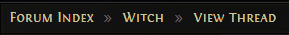

つまり、ここでは Witch を選べばいいとわかる。

他のビルドサイトなどの場合はこの判断方法は使えないので、_Necromancer_ などの職業名らしきものを見つけて「poe necromancer」などでググり、Wiki からどのキャラクターの Acendancy なのかを判断するとよいだろう。

例えば Necromancer なら

> The Necromancer is an Ascendancy class for the Witch.

と記載されている。

キャラ名は他人と被らなければなんでもいい。  
リーグ名を入れている人が多いくらいなので、キャラ名というよりは識別名のようなものだ。  
後から変更はできないが、気軽に決めてしまって問題ない。

#### 余談

ちなみにこのキャラクター作成のシーンでは、各キャラクターへの罪状が読み上げられている。  
罪を犯したため、Oriath と呼ばれる場所から追放（= Exile）されるシーンだからだ。

以降、プレイヤーが Exile と呼ばれることになる理由がここにあるわけだ。

## Act1 前半

### The Twilight Strand

島流しにあった可哀想な Exile が浜辺に打ち上げられるところからスタートする。

とりあえず適当に左クリックして移動する感覚を掴んだら、その辺に落ちてる武器をクリックして拾ってみよう。Witch の場合は Wand が落ちているはずだ。

自動的に装備されるかは設定によるが、されなかった場合はインベントリを開いて左クリックで掴み、左上の武器スロットに再度左クリックして装備しておこう。  
ちなみに武器スロットは左がメインハンド、右がサブハンドだ。二刀流も可能だが、盾や矢筒はサブハンドにしか装備できない。

次に、その状態で横のおっさんに話しかけよう。  
するとゾンビに殺されてしまう。儚い。  
せめて仇を取ってあげよう。ゾンビを左クリックすれば通常攻撃ができる。

ゾンビを倒すと Skill Gem が落ちる。Witch の場合は [Fireball](https://www.poewiki.net/wiki/Fireball) だ。  
インベントリを開いて Gem を左クリックして掴み、武器に開いている穴、つまりソケットに左クリックして嵌めよう。ちなみに外すときは右クリックだ。

すると右下の方にあるスキル欄の右上、つまり右クリック部分に Fireball が表示されているだろう。

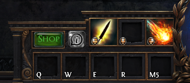

この状態で、適当なところを右クリックしてみると火の玉が発射されるはずだ。

もちろん、他のキーにセットしてもよい。スキル欄をクリックすることで自由に変更できる。  
ついでに左クリックの部分を足跡のようなマークの「Move Only」に設定しておくとよい。

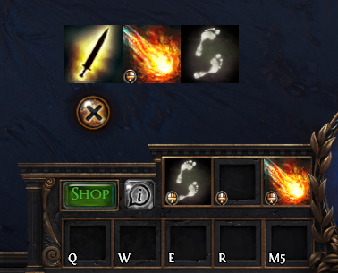

他の Character でも通常攻撃は弱いのであまり使わないのだが、特に Witch は拾う武器が Wand なので飛びぬけて弱いからだ。

さぁこれで準備はできたので、のんびり散歩しながら敵を燃やしていこう。  
左クリックで歩き、右クリックで Fireball を撃つだけなので難しいことはないはずだ。

敵を倒して落ちたアイテムは全部拾おう。  
要らないアイテムも後で売れるので無駄にはならない。  
もちろん装備可能なら装備しておこう。

しかし何度か Fireball を撃つとマナが無くなって撃てなくなる上、敵の攻撃に被弾していた場合は体力も減ってしまっているかもしれない。

UI の左下を見てほしい。数字の 1 ～ 5 とともに怪しげな試験管が並んでいるはずだ。（私は 5 を Space に変更しているが）  
これが他のゲームでいうポーションとなる、フラスコである。  
赤いフラスコは体力を回復し、青いフラスコはマナを回復する。

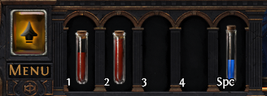

しばらくの間は、これらのフラスコを頻繁に使う状態になるので、戦闘中は基本的に数字キーの上に左手を置いておくとよいだろう。  
また、フラスコは種類にかかわらず敵を倒すことでまた使えるようになるため、出し惜しみする必要はない。  
なお、マナフラスコは最初一番右に配置されているが、押しづらい人はインベントリを開いて別のところに置いてもよい。

さて、のんびり散歩をしていると途中に光っている箱が置いてあるはずだ。  
左クリックで開けてみると Support Skill Gem が入っている。  
Witch の場合は [Arcane Surge Support](https://www.poewiki.net/wiki/Arcane_Surge_Support) だ。

この Support とつく Skill Gem は他の Skill Gem を強化する機能を持つ。  
Arcane Surge Support の場合は、そのスキルで一定のマナを消費すると[バフ](https://www.poewiki.net/wiki/Arcane_Surge)を得られるようになる。

さっそく嵌めてみよう。Fireball と同じように武器の開いているスロットに嵌める。
このとき、ソケット同士が線で繋がっているのがわかるだろうか？  
これをリンクと呼び、Support Skill Gem はこのリンクされている Gem のみを強化することを覚えておこう。

このあたりでレベルが上がるかもしれないが、手に入れた Passive Skill Point についてはひとまず無視していてほしい。

そうしてどんどん先に進んでいくと Hillock というボスが待ち構えている。
非常にわかりやすい攻撃動作なので、離れるように動きながら Fireball を撃つだけで簡単に倒せるはずだ。

もし死んでしまっても、Act5 までは何も失わないので何も問題ない。  
徐々に操作に慣れていこう。

#### パッシブツリーについて

Hillock を倒したら、満を持してパッシブツリーを開いてみよう。  
フラスコの右あたりにある「+」が書いてある大きなボタンを押すことで開ける。  
それ以外のときに確認した場合は 「MENU」ボタンから開いたり、「P」キーを押すことで開くことができる。

さて、他のゲームにも例を見ない巨大なツリーにびっくりしている頃だろうか。  
とはいえ私達には素晴らしいビルドガイドがついているので、何も恐れることはない。  
さっそくビルドガイドを確認してみよう。

Passive Skill Tree らしき表記を探すと、Skills and Links のセクションに Skill Tree が記載されていることがわかる。  
Skill Point の少ない順に記載されていることがわかるので、一番上の 14 skill points のツリーを見てみよう。



以降はここに書いてある通りにポイントを振っていけばよいわけだ。  
もちろん振り終わり次第、次の Tree を見ていくことになる。

実際に振り分けてみよう。  
まずは取得したいスキルを左クリック。

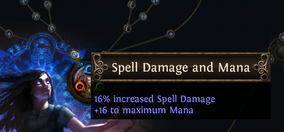

その後、上部に表示される「APPLY POINTS」をクリックすれば完了だ。

完了したらツリーを閉じよう。右上のバツボタンか、Esc キーで閉じることができる。  
その後一番奥にあるドアに近づくと、優しい人が開けてくれるのでクリックして拠点に入ろう。

### Lioneye's Watch

いわゆる拠点だ。  
やることはいろいろあるが、1 つずつやっていこう。

#### クエスト報酬

右の方にいる Tarkleigh に話しかけてみよう。  
Hillock を倒した報酬を得ることができる。

当然ストーリーは英語で語られるのだが、読めなければさっさとスキップして構わない。  
すると、報酬の Skill Gem を選ぶ画面になるはずだ。

ここではビルドガイドの How to Level with this build (for Newbies) セクションに記載されている通り、[Freesing Pulse](https://www.poewiki.net/wiki/Freezing_Pulse) を選択しよう。  
以降はこのセクションに書いてあることを読んでいる前提で記載していくため、「？」と思うことがあれば、ここを翻訳して読むとよいだろう。

手に入れた Freesing Pulse は Fireball と入れ替えて Wand に嵌めておく。  
外した Fireball は売ってもいいし、Stash に入れておいてもよいが、基本的は売ってしまってよい。

#### アイテムの鑑定について

もしかしたら道中、青や黄色の背景をした装備がドロップしているかもしれない。  
青はマジック、黄色はレアと呼ばれる等級の装備で、ドロップした段階では未鑑定のため装備できない。

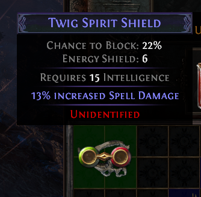

最初から 3 つ持っている Scroll of Wisdom という巻物のアイテムを使うことで鑑定できる。  
Scroll を右クリックしたあと、鑑定したい装備に左クリックで OK だ

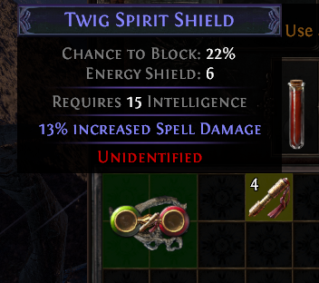

鑑定したアイテムは白、つまりノーマルの装備と同じように扱える。

#### アイテム売却

続いて装備できなかった装備品を売ってみよう。

ここで大事なことは装備品を売るときはなるべく鑑定してから売るということだ。  
鑑定してから売ったほうが得られる Currency Item=お金として使われるアイテムが多く手に入るからだ。  
もし Wisdom が足りなければ Rare 品だけでも鑑定してから売ろう。

なお、Orb of Transmutation という青い Currency は、売ると Wisdom 4 つになる。  
わりと使うテクニックなので足りなくなったら思い出してほしい。

さて肝心の売り方だが、Vendor と呼ばれる商人に対して取引することになる。  
Lioneye's Watch なら先程の Tarkleigh、もしくは Nissa となる。  
どちらかに話しかけた後、Sell Items をクリックしよう。

売り方は簡単だ。右側の自分のインベントリから売りたいものを左側の相手のインベントリに入れていこう。  
このとき左クリックで掴んで 1 つずつやってもいいが、基本的には売りたいアイテムを Ctrl+左クリックする。 こちらの方が圧倒的に早い。  
アイテムを買うときやスタッシュに物を入れるときも使えるテクニックなので、ぜひ覚えておいてほしい。

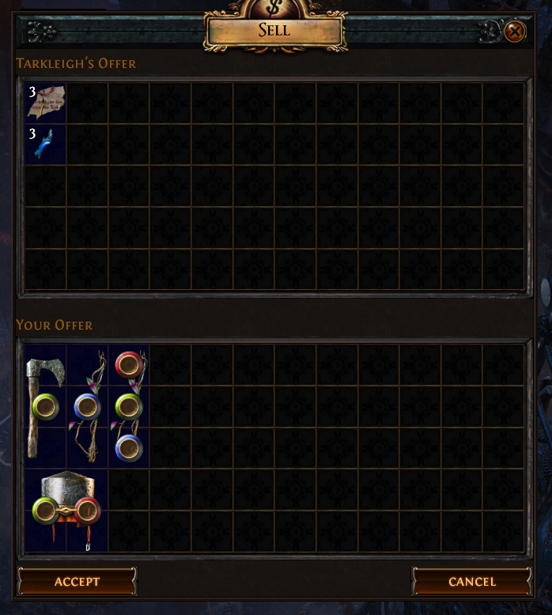

売るアイテムを確認したら「ACCEPT」を押して取引完了だ。

#### アイテム購入

アイテムを売ったので次は買ってみよう。

##### Skill Gem

Nissa に話しかけて Purchace Items をクリックだ。

1 番のタブには Wand や Flask、Jewellery と総称される Amulet、Belt、Ring などが売っているが、今回のお目当てはこれらではない。

2 番のタブを開いてみよう。Skill Gem がずらっと並んでいるはずだ。  
その中から [Raize Zombie](https://www.poewiki.net/wiki/Raise_Zombie) を買っておこう。前述の通り Ctrl+左クリックすれば簡単だ。  
もし Wisdom が足りなかったら、次に拠点に帰ってきたときに購入してほしい。

##### 3-Link

このゲームでは Skill のリンク数は何よりも火力に直結するため、その段階で手に入る最大のリンク数の装備を使うことが望ましい。  
なお、Act1 段階では 3 リンクが最大だ。

さて、ビルドガイドによるとこの段階で必要なのは*青-青-赤*と*青-青-青*のようだ（英語では B-B-R、BBR などと表記する）  
Tarkleigh や Nessa が販売しているものを確認して、該当するリンクのものがあれば購入しておこう。  
また、Vendor の品揃えはそのキャラのレベルが上がったときに更新されるため、拠点に戻る度に確認する癖をつけよう。

今回は B-B-B の Shield を購入できた。

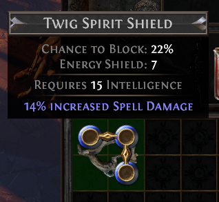

#### Stash

拠点の左の方に STASH と書いてある箱がおいてあるだろう。これがいわゆる倉庫だ。
初心者のうちはひとまず Currency 入れになるだろう。

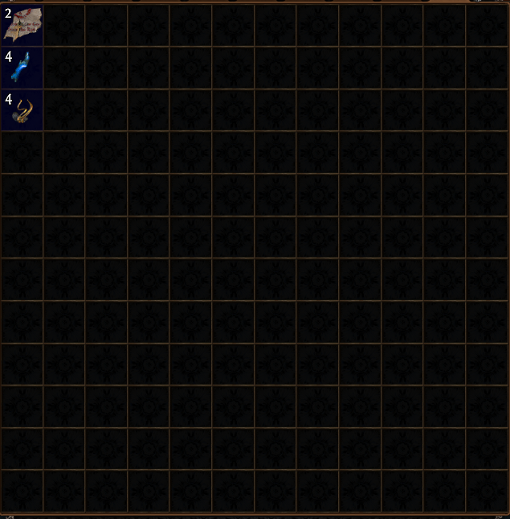

こんな感じで入れておくと良い。

また、アイテムをたくさん拾うために、インベントリは Wisdom と Portal Scroll だけの状態にしておこう。

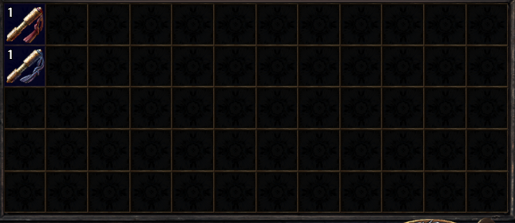

ここまで準備ができたら、The Coast に向かおう。

### The Coast

#### ここでやること

特段ない。  
Freesing Pulse で敵をなぎ倒し、Raise Zombie を敵の死体に使っていれば自然に突破できるはず。

#### 拾うアイテムについて

ここからの間拾うべきアイテムはこのあたりだ。

- Magic や Rare のアイテムすべて
- 緑色の枠がついているアイテム（売るとちょっと貴重な Currency になる）
- Normal だが、装備していない部位のアイテム
- BBB、BBR の 3 リンク装備
- 背景色が違う Currency などのアイテム

これ以外の白い装備品などは売っても大した価値が無いので、置いていってしまおう。

#### Skill Gem の レベルアップ

Skill Gem にもレベルや経験値があり、経験値が溜まると以下のようにレベルアップさせる UI が出てくる。

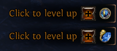

ごく一部の例外を除き、基本的にはどんどん上げてしまってよい。

なお、Str や Dex といった能力値が足りずレベルアップできない可能性があるが、Act1 では滅多にないのでここでは割愛する。

#### リーグ要素

このエリアでは特段やることがないのだが、毎回ここで今回のリーグ要素がお目見えするのが恒例となっている。  
正直初心者のうちは無視しても一向に構わないのだが、一応解説しておこう。

Sentinel リーグではこのような謎の箱が置いてある。

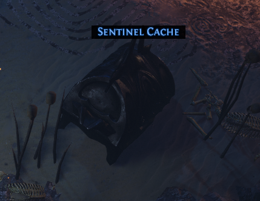

開けると謎の 2 つのアイテムが出てくるので、このうち左のアイテムを右クリックで装備しよう。

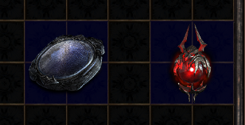

するとインベントリに謎の空白が出てくるので、ここに右のアイテムを入れよう。  
なお、左側に出てくるのは Sentinel 専用のパッシブツリーだ。適当に振っておいてもよい。

さて、実際に起動してみよう。
スキル欄の左側にあるボタンをクリックするか、そこに書いてあるキーを押そう（私はキー設定を変更している）。

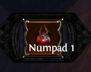

起動すると周りの敵が強化される代わりに、レアなアイテムを落とすようになる。
かなり強くなるので、勝てる自信があるときだけにやろう。

#### Waypoint

エリアの最後の方でこのようなオブジェクトがあるはずだ。クリックして起動しよう。

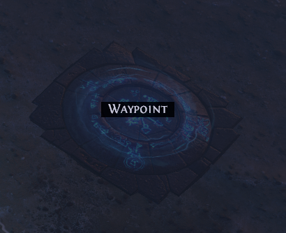

いわゆるワープポイントで、これを使うことで拠点に戻ったり、またここに戻ってくることができる。  
起動するデメリットはまったくないので、見つけたらどんどん起動しよう。

また、クリックした後 Esc を押すなどで、ワープしないことを選ぶこともできる。  
実際、この時点ではインベントリが空いていることが多いため、このまま The Tidal Island に向かうことが多い。  
もちろん一旦拠点に戻ってもよい。World 一覧から Lioneye's Watch をクリックだ。

### The Tidal Island

#### ここでやること

マップの向こう側にいるオレンジ色の名前のボスを倒し、落としたアイテムを拾うだけで終わりだ。拠点に帰ろう。

このとき歩いて先程の Waypoint まで戻ってもよいのだが、そこそこの距離があるため持っていれば Portal Scroll を使おう。右クリックすると出現する Portal に入るだけでよい。  
Act 中はそんなに使う機会がないので、こういう場合はどんどん使うと良い。

Lioneye's Watch に戻ったら、Nessa に話しかけクエスト報酬をもらおう。
選ぶのは Quicksilver Flask と [Summon Phantasm Support](https://www.poewiki.net/wiki/Summon_Phantasm_Support)だ。

前者は便利な移動速度を上げるフラスコなので、空いているところに入れておこう。  
後者は可能なら Raise Zombie にリンクさせよう。

おそらく更新されている販売物を確認したら、Waypoint から The Coast に戻り、The Mud Flats に向かおう。

### The Mud Flats

#### ここでやること

Rhoa Nests を 3 つクリックして Glyph を手に入れ、glyph wall に持っていくことで道が開く仕組みになっている。  
敵の倒し方は The Tidal Island と変わらない。

また、メインの一本道とは別に寄り道できるエリアがあり、こちらも重要なので必ず行こう。  
好きな方から攻略して構わないが、今回はわかりやすく後者の The Fetid Pool からやっていくことにする。

### The Fetid Pool

#### ここでやること

このエリアにいる敵を全部倒すのがクエストになっている。  
ぐるっと一周回る形になっているので、漏れがないようにマップを注視しつつ好きな方から回っていこう。

また、このあたりから敵が固くなってくるので、装備の更新やフラスコを飲むタイミングを徐々に意識していこう。

全ての敵を倒すと浄化されて画面が明るくなるはずだ。  
Portal を出して一旦帰ってもよいが、次の目的地が Waypoint から遠いのでこのまま次に向かうことをおすすめしたい。

### The Submerged Passage

#### ここでやること

入って早々に Waypoint があるので、記事通りに The Fetid Pool から直接来た人はいったん街に帰って、下記の拠点でやることをやってきてほしい。

その後戻ってきた後は、ここも寄り道エリアがあるため好きな順序で攻略することになる。  
先ほど同様、ここでは寄り道エリアとなる The Flooded Depths から回っていくことにする。

また、新しく使うことになる Summon Raging Spirit （よく SRS と略される） は非常に使い勝手が良いスキルで、長押ししているだけで勝手に敵を探して倒してくれる頼れる相棒となるだろう。

#### 拠点でやること

Tarkleigh から [Summon Raging Spirit](https://www.poewiki.net/wiki/Summon_Raging_Spirit) と、[Frostblink](https://www.poewiki.net/wiki/Frostblink) を受け取ろう。

その後、Freezing Pulse と Summon Raging Spirit を入れ替え、Frostblink は好きなところに嵌めておこう。  
嵌める場所がなければ、なるべく早く青いソケットが付いた装備を拾ってこよう（買うのはお金がもったいないので最後の手段だ）。

また、この時点で [Holy Flame Totem](https://www.poewiki.net/wiki/Holy_Flame_Totem) を買えるのであれば買っておこう。  
攻略がかなり楽になる。

### The Flooded Depths

#### ここでやること

奥まで進んでオレンジの名前のボスを倒すだけだ。  
とても簡単なので、それ以外のチェックをしていこう。

新しく入手した Frostblink は Movement スキルと呼ばれる移動するスキルで、特に Dash や Blink と名の付くスキルは川や段差を越えて移動できるため、非常に重宝することになる。  
このエリアでも飛び越えられる水辺が多いはずだ。試してみるとよい。

また、平地で使った場合でも普通に歩くより段違いに速く移動できるので、基本的にはクールダウンが解消するたびに連打することになるだろう。

ボス戦では Holy Flame Totem を持っていれば出しておこう。  
なくても時間がかかるだけで簡単に倒せる。

### The Ledge

#### ここでやること

何もない。駆け抜けるだけ。

ここと次のエリアは Waypoint が中央付近にあって区切りが悪いので、どのタイミングで拠点に戻るかはインベントリと相談しながら決めよう。

### The Climb

#### ここでやること

何もない。相変わらず駆け抜けるだけ。

ただここの Waypoint は踏み忘れがちだったりする。  
特段戻ってくる用事はないが、コンプリートしないと気になってしまう人は注意しておこう。

### The Lower Prison

#### ここでやること

入ってすぐ Waypoint がある。一旦拠点に戻ろう。  
やることは以下に記載している。

戻ってきたら、さらに下側に記載している「Trial について」を読み進めてほしい。

#### 拠点でやること

Nessa から [Added Lightning Damage Support](https://www.poewiki.net/wiki/Added_Lightning_Damage_Support) を受け取り、さらに Nessa からもう 1 つ同じものを買おう。

片方は SRS に、もう片方は Raise Zombie にリンクさせる。

さらに Nessa から Melee Splash Support を買って、SRS にリンクさせておこう。

つまり、現時点で以下のリンクとなっていればよい。

- Raise Zombie - Summon Phantasm Support - Added Lightning Damage Support
- Summon Raging Spirit - Melee Splash Support - Added Lightning Damage Support

言い忘れていたが、リンクの順番は原則関係がないので繋がってさえいればよい（一部例外があるが、ごくごく稀である）。  
またガイドに従っているうちは関係ないが、1 つの Gem に対して同じ Support Skill Gem を重複してリンクさせることはできない。念のため覚えておこう。

また、もし先程 Holy Flame Totem を買っていなければこのタイミングで買っておこう。

#### Trial について

The Lower Prison を探索していると、謎のマークとともにトゲだらけの場所を見つけられると思う。  
これが Trial と呼ばれる場所で、この Trial を 6 つクリアすることで Act3 で Labyrinth に挑むことができるようになる。

ひとまず現時点では Labyrinth をクリアすれば強くなれる、と認識しておけばよい。  
目の前の Trial をクリアしてみよう。

まずはトゲの動きをよく観察して、できるだけ踏まないように奥にあるレバーまで辿り着こう。  
起動した後はまたゆっくり観察しながら戻ってこよう。

もし何回か踏んでしまっても冷静にライフフラスコを飲めば問題ない。  
ただし限りがあるのでなるべく踏まないように気を付けよう。

その後、レバーで開いたドアに入り奥に向かうのだが、このとき段差を Frostblink で抜けると非常に楽になる。  
トラップが多い場合、Movement スキルが文字通り生命線になることが多いのをここで体感しておこう。

最後に謎の石板をクリックして、出てきたポータルに入れば完了だ。

次のエリアに行こう。

### The Upper Prison

#### ここでやること

最後のエリアまで辿り着くと、中ボス [Brutus](https://www.poewiki.net/wiki/Brutus,_Lord_Incarcerator) と戦うことになる。

非常に攻撃がわかりやすいボスなので、攻撃を避けるのは簡単だと思われる。

攻撃するときは以下のようにするとよい。

- 自分と Brutus の間に Holy Flame Totem を出す
- そのまま SRS を撃ち続ける
- Holy Flame Totem の周りで Spirit が攻撃するように心掛ける

なぜなら Holy Flame Totem の周りには [Consecrated ground](https://www.poewiki.net/wiki/Consecrated_ground) が展開されるため、周りの Minion がライフリジェネを得て死にづらくなるからだ。

倒し終わったら次のエリアへ向かおう。

### Prisoner's Gate

#### ここでやること

早々に Waypoint があるので一旦拠点に戻ろう。

ここもやることは特にないのだが、途中で通せんぼされるイベントがある。  
周りをよく探すと抜け道があるので、そこから先に進もう。

#### 拠点でやること

Tarkleigh から [Flame Dash](https://www.poewiki.net/wiki/Flame_Dash) を貰い Frostblink と入れ替えよう。  
Frostblink と同じようなスキルだが、最大 3 回分チャージを貯めておいて一度に使うことができるという利点があるスキルだ。

次に Nessa から [Vitality](https://www.poewiki.net/wiki/Vitality) と [Clarity](https://www.poewiki.net/wiki/Clarity) を購入しよう。  
このとき Currency が足りなければ Vitality だけでも買おう。

Vitality はライフのリジェネ、Clarity はマナのリジェネを高めてくれるオーラスキルだ。

オーラ（Aura）はチャンネリング、つまり切り替え式のスキルで、発動している間 Exile の周りの味方に効果を付与する（多少の例外はあるが）。  
このときマナを一定量リザーブ（予約）、つまり使えなくする必要があるが、このリザーブする量はそのスキルによって変わる。

ほとんどのオーラは 25%や 50%などの割合でリザーブするが、この段階で手に入る [Vitality](https://www.poewiki.net/wiki/Vitality) と [Clarity](https://www.poewiki.net/wiki/Clarity)、そして [Precision](https://www.poewiki.net/wiki/Precision) の 3 つのオーラだけはジェムのレベルに応じて固定値でリザーブする仕様になっている。  
ビルドガイドに Clarity を Lv1 で止めるよう書かれているのはこの仕様が理由である。

スキルジェムのレベルを上げないようにするのは簡単だ。  
[The Coast の「Skill Gem のレベルアップ」](#skill-gem-の-レベルアップ)で説明したときの「+」ボタンを右クリックするだけで良い。  
もしも後から上げたくなった場合は、インベントリの下の方に小さく表示されているのでそこを見よう。

間違えてレベルを上げてしまった場合でも、1 と 2 では大した差がないので気にしなくてよい。  
気になるのであれば、Nessa からもう 1 つ買ってくるのが早いだろう。

このときに、[Flesh Offering](https://www.poewiki.net/wiki/Flesh_Offering) という死体を消費してバフをかけるスキルを買ってもいいのだが、初心者のうちはスキルは少ない方が混乱しづらいと思うので、今回は採用しないことにする。

### The Ship Graveyard

#### ここでやること

The Ship Graveyard Cave という寄り道エリアに行かないとクエストを消化できないため、そちらへ先に向かう。

最深部で Allflame というアイテムを見つけたら The Ship Graveyard に戻り、Captain Fairgraves を探して渡そう。  
渡すと恩も忘れて襲い掛かってくるので、返り討ちにしよう。

倒したらそのまま次のエリアに向かう。

### The Cavern of Wrath

#### ここでやること

入って早々 Waypoint があるので拠点に戻ろう。

それ以外は先に進むだけだ。Absolution の使い勝手を確認しておこう。

#### 拠点でやること

[Absolution](https://www.poewiki.net/wiki/Absolution) を買おう。ここからずっと付き合う相棒になるメインスキルだ。  
ついでに Summon Phantasm Support をもう 1 つ購入しておく。

その後、以下のようにジェムを入れ替える。

- Holy Flame Totem を外す。
- SRS と Melee Splash Support を外し、代わりに Absolution と Summon Phantasm Support を嵌める。

まとめると以下の状態になっているはずだ。

- Raise Zombie - Summon Phantasm Support - Added Lightning Damage Support
- Absolution - Summon Phantasm Support - Added Lightning Damage Support
- Vitality
- Clarity(Lv1)
- Flame Dash

スキルのリンクを確認したら先に進もう。

### The Cavern of Anger

#### ここでやること

先に進むだけだ。  
Act1 最後のエリアだが難しいところはない。

最奥部に Act1 ボス [Merveil](https://www.poewiki.net/wiki/Merveil,_the_Siren) が控えている。

#### Merveil, the Siren

全体的に派手になってはくるが、基本的には何も変わらない。  
敵の攻撃を落ち着いて避けながら攻撃していこう。

相手の攻撃が全て Cold 属性なため、Cold Resistance、いわゆる抵抗を増やしておくとダメージを大きく軽減できる。  
Act1 時点では Sapphire Ring を見つけたら拾っておくくらいが関の山だが、後々重要になってくる概念なので今のうちに意識しておこう。

そして Merveil を倒せば Act2 への道が開く。

## おわりに

Act1 攻略、いかがだっただろうか。  
思いのほか簡単で、もっと先に進みたくなった人が大半だろう。

しかし安心してほしい。  
このゲームは Act10 まである上、むしろその先がメインコンテンツなのだから。

Act1 の攻略を通してビルドガイドの読み方もなんとなくわかってきただろう。  
Act2 以降の攻略についてはもはや説明はいらないかもしれないが、要望があった部分については個別に解説していこうと思う。

PoE は覚えることが非常に多く、全ての要素を完全に理解している人間は開発者も含めて 1 人もいないと言われているほど難しいゲームである。  
しかし、それ故に面白く、それ故に熱中するのだ。

新しい Exile の船出に祝杯を上げよう。

**Welcome to Wraeclast, Exile !**
